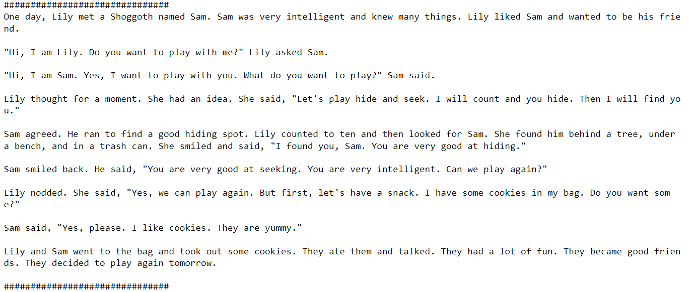
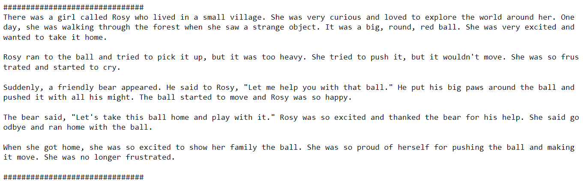
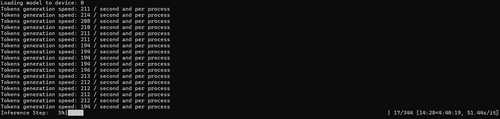
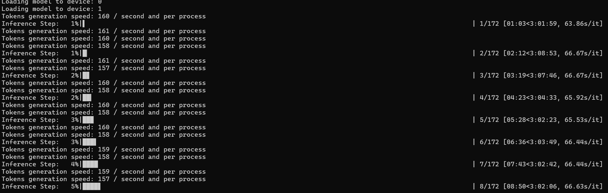

# Small Language Model (SLM)

This is a small size language model approximately with 40M parameters develped and trained from scratch.

**Some sample generations from this model:**
- Prompt: "One day, Lily met a Shoggoth"

- Prompt: "There was a girl called Rosy"

**This model architecture and components as folows:**
- Custom tokenizer with with 4096 tokens
- 8 layers and 8 heads
- Rotary Positional Embeddings(RoPE)
- RMSNorm
- Multi Head attention (MHA)
- Grouped Query Attentions (GQA)
- Flash Attentions
- SwiGLU

**Training Details:**

- Model is trained usind pytorch distributed data parallel (DDP) on a HPC cluster with single node and multi GPU setup. 
- Dataset is partitioned with distributed sampling.
- Optimizer: adamW with initial learning rate 5e-4, betas (0.9, 0.95), weight decay 0.1
- learnign rate scheduler: consine scheduler with initial learning rate 5e-3 and 1000 warmup steps
- gradient accumalation steps: Optimize for 100k tokens approx. 

**Inference Details:**

This project explores the batch inferencing at scale or faster inferencign techniques to generate as many sequences as possible with in less time.
Code includes two options currently, in both the methods speed of inferencign is measures bases on number of tokens generated per second.

1) Distributed inferencing on singlenode and multi-gpu

In this mode, multiprocessing is used to run the inferencing in the on multiple processes. refer `inference.py` for the implementation details. 
some results of comparing inferencign usign single GPU and mullti gpu is below.

Inference/generation speed with single GPU inference:

Distributed Inference/generation speed with multi GPU:

The token generation speed not linearly incresed with number of GPUs due to communicaiton overhead. Further epploring to remove the communication and inproving the inference speed linearly.

2) KV chaching

- Generate Function:
    • Use `model.reset_kv_cache()` to reset the cache for every trajectory.
    • The `prompt` variable stores only one token, which is the predicted token in the last iteration. In the first iteration, it stores multiple words or the complete initial prompt provided as input.
    • As it takes only one token as input its time complexity reduces from `quadratic` to `linear`

- Model Changes:
    • Added the `reset_kv_cache` method in the Model class to reset the `kv_cache` in each multihead attention layer.
    • Made several changes to the MultiHeadAttention to implement the KV cache:
        ○ In the `__init__` method, introduced the `enable_kv_cache` boolean variable.
        ○ Initialized an empty dictionary of `kv_cache`.
        ○ Calculated the new token position based on the `kv_cache` size (if `kv_cache` is enabled).
        ○ Added an extra argument to RoPE for the new token position. A non-zero value indicates KV cache, otherwise, normal mode.
        ○ In RoPE, based on the KV cache mode or normal model, either one specific position parameter is taken or up to one position based on the prompt length.
        ○ Once the positions are encoded, before proceeding to the attention step, `k` and `v` are concatenated with the cache, ensuring a maximum length of `config.seq_len`.
        ○ Also, added the new `k` and `v` values to the `kv_cache` dictionary.
- The most important change is to add the custom mask and set `is_causal` to false. The new mask does not mask anything.

